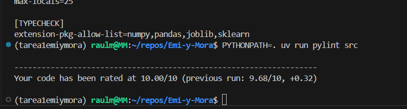

# Emi-y-Mora — ML Pipeline (Tarea 03)

Este repositorio implementa un pipeline **end-to-end** para un problema de predicción de demanda mensual por **tienda–producto**. A partir de datos crudos (`data/raw/`), el proyecto construye un dataset a nivel mensual, genera *features* (categoría, estacionalidad, lags y agregados) y produce particiones temporales de entrenamiento/validación.

Luego entrena un modelo baseline (Ridge) y un modelo principal (Gradient Boosting Regressor), evalúa con métricas estándar y guarda artefactos reproducibles. Finalmente, corre inferencia en batch para generar el archivo `submission.csv` 


---
## Estructura del repositorio 
.
├── .git
│   ├── HEAD
│   ├── branches
│   ├── config
│   ├── description
│   ├── hooks
│   │   ├── applypatch-msg.sample
│   │   ├── commit-msg.sample
│   │   ├── fsmonitor-watchman.sample
│   │   ├── post-update.sample
│   │   ├── pre-applypatch.sample
│   │   ├── pre-commit.sample
│   │   ├── pre-merge-commit.sample
│   │   ├── pre-push.sample
│   │   ├── pre-rebase.sample
│   │   ├── pre-receive.sample
│   │   ├── prepare-commit-msg.sample
│   │   ├── push-to-checkout.sample
│   │   ├── sendemail-validate.sample
│   │   └── update.sample
│   ├── index
│   ├── info
│   │   └── exclude
│   ├── logs
│   │   ├── HEAD
│   │   └── refs
│   ├── objects
│   │   ├── info
│   │   └── pack
│   ├── packed-refs
│   └── refs
│       ├── heads
│       ├── remotes
│       └── tags
├── .gitignore
├── .pylintrc
├── .ruff_cache
│   ├── .gitignore
│   ├── 0.15.0
│   │   └── 409948882473263137
│   └── CACHEDIR.TAG
├── .venv
│   ├── .gitignore
│   ├── .lock
│   ├── CACHEDIR.TAG
│   ├── bin
│   │   ├── activate
│   │   ├── activate.bat
│   │   ├── activate.csh
│   │   ├── activate.fish
│   │   ├── activate.nu
│   │   ├── activate.ps1
│   │   ├── activate_this.py
│   │   ├── deactivate.bat
│   │   ├── debugpy
│   │   ├── debugpy-adapter
│   │   ├── f2py
│   │   ├── fonttools
│   │   ├── get_gprof
│   │   ├── get_objgraph
│   │   ├── httpx
│   │   ├── ipython
│   │   ├── ipython3
│   │   ├── isort
│   │   ├── isort-identify-imports
│   │   ├── jlpm
│   │   ├── jsonpointer
│   │   ├── jsonschema
│   │   ├── jupyter
│   │   ├── jupyter-dejavu
│   │   ├── jupyter-events
│   │   ├── jupyter-execute
│   │   ├── jupyter-kernel
│   │   ├── jupyter-kernelspec
│   │   ├── jupyter-lab
│   │   ├── jupyter-labextension
│   │   ├── jupyter-labhub
│   │   ├── jupyter-migrate
│   │   ├── jupyter-nbconvert
│   │   ├── jupyter-run
│   │   ├── jupyter-server
│   │   ├── jupyter-troubleshoot
│   │   ├── jupyter-trust
│   │   ├── normalizer
│   │   ├── numpy-config
│   │   ├── pybabel
│   │   ├── pydoc.bat
│   │   ├── pyftmerge
│   │   ├── pyftsubset
│   │   ├── pygmentize
│   │   ├── pyjson5
│   │   ├── pylint
│   │   ├── pylint-config
│   │   ├── pyreverse
│   │   ├── python -> /usr/bin/python3
│   │   ├── python3 -> python
│   │   ├── python3.12 -> python
│   │   ├── ruff
│   │   ├── send2trash
│   │   ├── symilar
│   │   ├── ttx
│   │   ├── undill
│   │   └── wsdump
│   ├── etc
│   │   └── jupyter
│   ├── lib
│   │   └── python3.12
│   ├── lib64 -> lib
│   ├── pyvenv.cfg
│   └── share
│       ├── applications
│       ├── icons
│       ├── jupyter
│       └── man
├── 1C_Reporte.pdf
├── README.md
├── artifacts
│   ├── 1C_Reporte.pdf
│   ├── logs
│   │   ├── inference_20260205_114954.log
│   │   ├── prep_20260205_103330.log
│   │   ├── prep_20260206_180603.log
│   │   └── train_20260205_105322.log
│   ├── metrics.json
│   ├── model.joblib
│   └── modelo_final.joblib
├── assets
│   └── pylint_10of10.png.png
├── data
│   ├── predictions
│   │   └── submission.csv
│   ├── prep
│   │   ├── X_test.csv
│   │   ├── X_valid.csv
│   │   ├── y_train.csv
│   │   └── y_valid.csv
│   └── raw
│       ├── item_categories.csv
│       ├── items.csv
│       ├── sales_train.csv
│       ├── sample_submission.csv
│       ├── shops.csv
│       └── test.csv
├── notebooks
│   ├── .ipynb_checkpoints
│   │   ├── Untitled-checkpoint.ipynb
│   │   └── eda01-checkpoint.ipynb
│   ├── Entre_eval_prediccion.ipynb
│   ├── Untitled.ipynb
│   ├── eda01.ipynb
│   └── transform_fitures.ipynb
├── pyproject.toml
├── src
│   ├── __init__.py
│   ├── __pycache__
│   │   ├── __init__.cpython-312.pyc
│   │   ├── inference.cpython-312.pyc
│   │   ├── prep.cpython-312.pyc
│   │   └── train.cpython-312.pyc
│   ├── inference.py
│   ├── prep.py
│   ├── train.py
│   └── utils
│       ├── __init__.py
│       ├── __pycache__
│       ├── features.py
│       ├── logging_config.py
│       └── paths.py
└── uv.lock


## Instalación y setup 
Requisitos: 
 Linux / WSL recomendado
 Python 3.x
 uv instalado

```bash
git clone <https://github.com/EmilianoIslasF/Emi-y-Mora.git>
cd Emi-y-Mora
uv sync
```
## Como ejecutar el pipeline 
1) Preparación de datos (prep)

```bash
uv run python -m src.prep
```
2) Entrenamiento (train)

```bash
uv run python -m src.train

```
3) Inferencia / predicción (inference)

```bash
uv run python -m src.inference

```

## Scripts: descripción (inputs/outputs)

src/prep.py
Carga datos crudos, valida, limpia y genera features. Escribe datasets procesados en data/prep/.

src/train.py
Entrena el modelo usando los datasets procesados. Guarda el modelo y métricas en artifacts/.

src/inference.py
Carga el modelo entrenado y produce el archivo final de predicciones (submission.csv) en data/predictions/.


## Métrica y resultados

Métrica: RMSE

RMSE (validación): <0.9655>

Kaggle leaderboard / score: <1.00129>

## Dependencias principales

### Runtime
- pandas
- numpy
- scikit-learn
- joblib

### Desarrollo
- uv
- ipykernel
- ruff
- pylint


## Calidad de código (Pylint)



```


